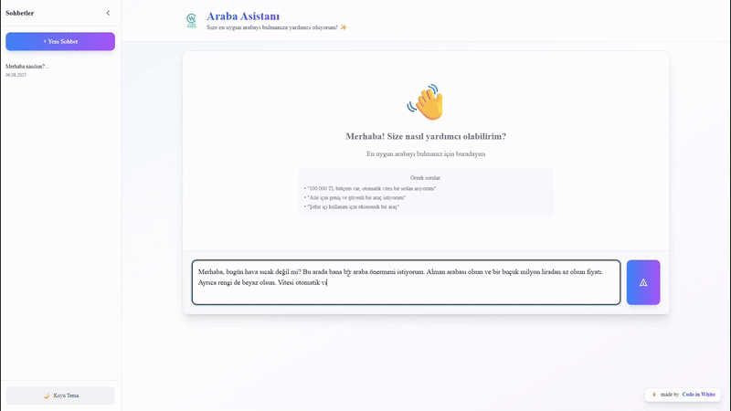

# 🚗 İkinci El Araçlar için Sanal Asistan

**İkinci el araç satın alma deneyiminizi, sohbet tabanlı yapay zeka ile yeniden şekillendirin.**
LINK => http://aracasistani.duckdns.org/
---

## 📖 Proje Hakkında

İkinci el bir araç satın almak, çoğu zaman onlarca sekme arasında kaybolduğunuz, sayısız filtreyi defalarca ayarladığınız ve nihayetinde aradığınız kriterlere tam olarak uyan bir aracı bulmanın zorluğuyla geçen, yorucu bir dijital yolculuktur. Pazardaki bu karmaşıklık ve zaman kaybı, tüketiciler için büyük bir engel teşkil etmektedir.

**İkinci El Araçlar için Sanal Asistan**, bu geleneksel ve verimsiz arama sürecine modern bir çözüm sunar. Projemiz, kullanıcıları statik formların ve soğuk filtre menülerinin kısıtlamalarından kurtararak, süreci akıcı, sezgisel ve etkileşimli bir sohbete dönüştürür. Artık "ne aradığınızı" bir arama kutusuna yazmak yerine, "ne istediğinizi" doğrudan sanal asistanımıza anlatabilirsiniz. Bu yaklaşım, sadece bir arama yapmaktan öte, cebinizde size özel çalışan kişisel bir araç uzmanıyla konuşma deneyimi sunarak, tüm süreci kökten değiştirmeyi hedefler.

 

 

## 🤖 Sistem Çalışma Diyagramı

 

 

## ✨ Öne Çıkan Özellikler

- 💬 **Doğal Dil Anlama:** Karmaşık formlar yerine asistanla sohbet ederek araç sorgulayın. ("*Bana 500.000 TL altında, otomatik vitesli, aile için uygun bir SUV bul.*")
- ⚙️ **Detaylı Filtreleme:** Marka, model, yıl ve kilometre gibi temel kriterlerin yanı sıra vites tipi, yakıt türü, kasa tipi gibi teknik detaylara göre arama yapın.
- 🛠️ **Hassas Kriterler:** "*Boyası veya değişeni olmasın*", "*hasar kaydı az olsun*" gibi özel ve yoruma açık talepleri anlayarak en ince detaylara göre filtreleme yapın.
- 🔗 **Doğrudan Erişim:** İlgilendiğiniz aracın ilanına ve satın alma sayfasına tek tıkla ulaşın.
- 🚀 **Modern ve Hızlı Arayüz:** Kullanıcı deneyimini en üst düzeye çıkaran akıcı ve şık bir arayüzle tanışın.
- 🧠 **Akıllı Yanıtlar:** Sorularınıza anında ve akıllı yanıtlar üreten güçlü yapay zeka altyapısı.

## 🛠️ Teknik Mimarisi ve Nasıl Çalışır?

Bu kullanıcı dostu deneyimin arkasında, yüksek performanslı ve modern bir teknik mimari yatmaktadır. Projenin beyni, kullanıcıların doğal dilde sorduğu soruları anlayan ve bunları veritabanı sorgularına dönüştüren akıllı bir sistemdir.

> **Kullanıcı Deneyimi Akışı:**
> 1.  **Kullanıcı Etkileşimi (Frontend):** Kullanıcı, React.js ile geliştirilmiş modern arayüz üzerinden talebini yazar.
> 2.  **İstek Yönetimi (Backend):** İstek, Python tabanlı **FastAPI** sunucusuna iletilir.
> 3.  **Yapay Zeka İşlemi (AI Core):**
>     * **Langchain** kullanılarak geliştirilen bir **SQL Agent**, bu doğal dil girdisini alır.
>     * **Google Gemini API**'nın gücüyle bu metni analiz eder ve bir SQL sorgusuna dönüştürür.
>     * Oluşturulan SQL sorgusu, araç bilgilerinin tutulduğu **SQLite** veritabanında çalıştırılır.
> 4.  **Yanıt Üretimi:** Veritabanından alınan sonuçlar, yine Gemini API kullanılarak kullanıcıya doğal dilde bir yanıt olarak sunulur ve ilgili araçlar listelenir.

Tüm bu sistem, **Amazon EC2** sunucularında **Nginx** ile güvenilir ve kesintisiz bir şekilde çalışmaktadır.

## 💻 Kullanılan Teknolojiler

### 🔹 Frontend (Kullanıcı Arayüzü)

| Teknoloji | Açıklama |
| :--- | :--- |
| **[React.js](https://reactjs.org/)** | Modern ve dinamik kullanıcı arayüzleri oluşturmak için. |
| **[Vite](https://vitejs.dev/)** | Hızlı ve verimli bir geliştirme ortamı için. |
| **[Tailwind CSS](https://tailwindcss.com/)** | Hızla şık tasarımlar oluşturmak için. |
| **[shadcn/ui](https://ui.shadcn.dev/)** | Yeniden kullanılabilir ve estetik UI bileşenleri için. |
| **[Framer Motion](https://www.framer.com/motion/)** | Akıcı ve pürüzsüz animasyonlar için. |
| **[Axios](https://axios-http.com/)** | Backend ile iletişim kurmak için. |

### 🔹 Backend (Sunucu ve Yapay Zeka)

| Teknoloji | Açıklama |
| :--- | :--- |
| **[FastAPI](https://fastapi.tiangolo.com/)** | Yüksek performanslı API'ler oluşturmak için Python framework'ü. |
| **[Langchain](https://www.langchain.com/)** | Büyük dil modellerini (LLM) uygulamalara entegre etmek için. |
| **[Google Gemini API](https://ai.google.dev/)** | Doğal dil anlama ve üretme görevleri için. |
| **[SQLite](https://www.sqlite.org/)** | Hafif ve sunucusuz veritabanı çözümü. |
| **[Uvicorn](https://www.uvicorn.org/)** | FastAPI için hızlı bir ASGI sunucusu. |

### 🔹 Sunucu ve Dağıtım (Deployment)

| Teknoloji | Açıklama |
| :--- | :--- |
| **[Amazon EC2](https://aws.amazon.com/ec2/)** | Güvenilir ve ölçeklenebilir bulut sunucusu. |
| **[Nginx](https://nginx.org/)** | Yüksek performanslı web sunucusu ve reverse proxy. |
| **[DuckDNS](https://www.duckdns.org/)** | Dinamik IP adresini sabit bir alan adına yönlendirmek için. |

---

Bu proje, güçlü teknik temelleri yenilikçi bir fikirle birleştirerek, araç satın alma sürecini herkes için erişilebilir, keyifli ve verimli hale getiren bütüncül bir çözüm sunmaktadır.
